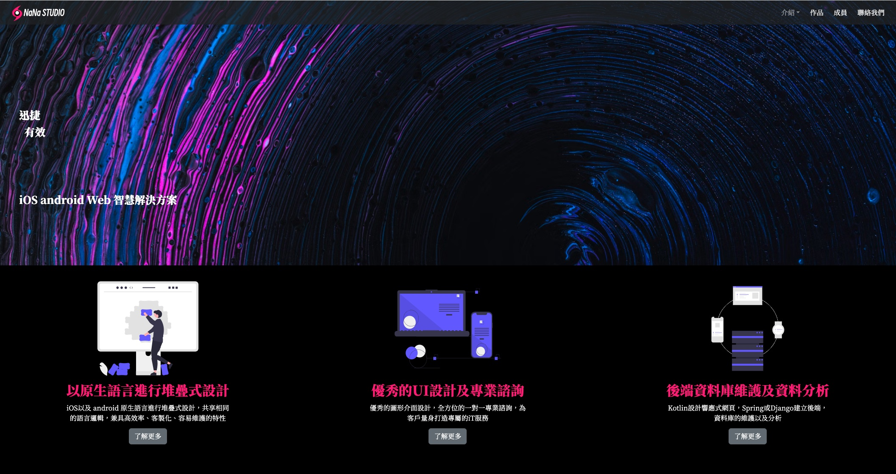
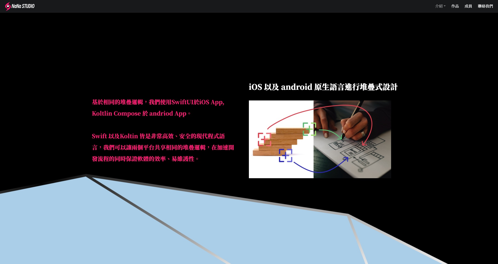
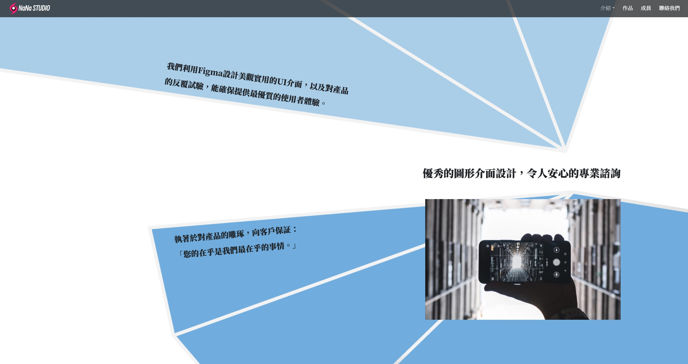
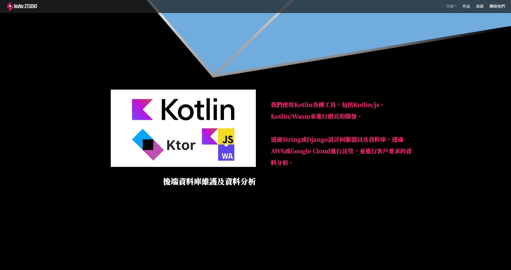

這是假想以一間科技公司為需求開發的網站，使用[Kotlin/Js](https://kotlinlang.org/docs/js-overview.html)相關的技術，搭配React的架構，bootstrap的UI設計，以及一些jQuery的語法。這一套連招基本上應該可以應對大多數的網路設計需求，Kotlin強型別語言以及物件導向的特性也彌補了javaScript的一些缺點，使開發人員更容易維護，唯一的缺點便是目前使用的人較少，因此相關的package以及參考資源都相對稀缺。

